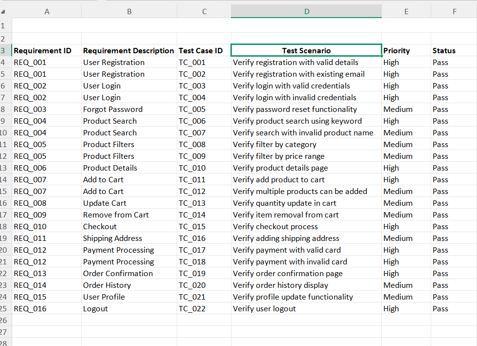

# e-commerce-website-testing

Manual Testing project for an E-Commerce Website including Test Plan, Test Cases, Bug Report, RTM and Test Summary Report.

# E-Commerce Website Testing

## Project Overview

This repository contains manual testing artifacts for an E-Commerce Website.

## Project Scope

- User Registration
- Login & Logout
- Forgot Password
- Product Search
- Product Filters
- Product Details
- Add to Cart
- Update Cart
- Remove from Cart
- Checkout
- Payment Processing
- Order History
- User Profile

## Testing Types

- Functional Testing
- Smoke Testing
- Sanity Testing
- Regression Testing
- Positive Testing
- Negative Testing

## Tools Used

- Microsoft Excel
- GitHub

## Project Documents

- Test Plan.xlsx
- Test Cases.xlsx
- Bug Report.xlsx
- RTM.xlsx
- Test Summary Report.xlsx
- 
## Screenshots

### Test Cases

### Bug Report

### RTM

## Author

Saba Sheikh
